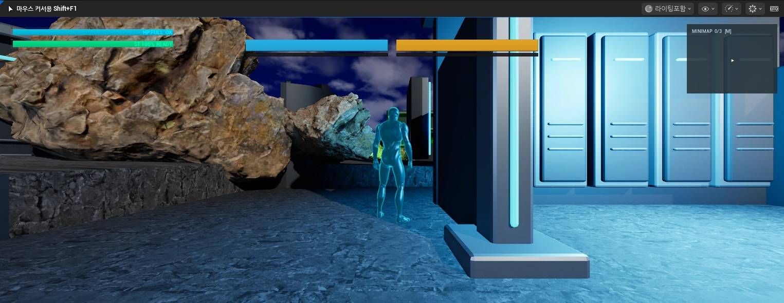

# 박재영 | 게임 클라이언트 · 게임플레이 프로그래머

C++·Unreal Engine과 C#·Unity로 전투, 보스, UI와 저장 흐름을 구현합니다.

**[취업 포트폴리오 보기](https://jay-0x50.github.io/Introduction/)** · [이력서·자기소개서](https://jay-0x50.github.io/Introduction/index_com.html) · [프로젝트 기술서](./projects.html)

## 대표 작업

| 프로젝트 | 만든 것 | 설명할 경험 |
| --- | --- | --- |
| Exception | Unreal Engine 액션 RPG의 전투·보스·HUD·저장 | 공격별 중복 피해 방지, 보스 공격 조율, 상태 연결 |
| Error Dungeon | Unity 전투·재도전 흐름, WebGL 로컬 VM 배포 | 콤보 입력 버퍼, 체크포인트 복구, 캐시·502 점검 |
| PyMax | Python·Pygame 4키 리듬 게임 | 리소스 로딩 완료를 기준으로 재생 시작 조건 변경 |
| SpaceOut | C++·Win32/GDI 학원 예제 기반 슈팅 실습 | 입력·충돌·출력, 스프라이트 수명 이해 |

각 프로젝트는 게임 화면 → 맡은 기능 → 해결할 문제 → 구현과 결과 순서로 소개합니다. 취업용은 필요한 구현 위치로 연결하고, 진학용은 핵심 코드와 단계별 해설을 함께 보여줍니다. Error Dungeon은 로컬 Linux VM 배포 경험이며 공개 서비스 운영 실적으로 소개하지 않습니다.

## 제출용 PDF

- [취업 포트폴리오 · 8쪽](./output/pdf/ParkJaeyoung_Portfolio_Career.pdf)
- [이력서·자기소개서 · 2쪽](./output/pdf/ParkJaeyoung_Resume.pdf)
- [프로젝트 기술서](./output/pdf/ParkJaeyoung_Project_Experience.pdf)
- [진학 포트폴리오 · 14쪽](./output/pdf/ParkJaeyoung_Portfolio_Admission.pdf)

진학용은 청강대 게임 프로그래밍 지원에 맞춰 제작 경험·핵심 코드·설계 이유·배운 점·학업 계획을 담은 PDF로 제출합니다. 전투 판정, 상태 전환, HUD 이벤트, 콤보 입력 버퍼, 시간 계산의 코드 해설 5쪽을 포함합니다. 이력서는 취업용에서만 연결합니다.

## 공부와 면접 준비

[게임 개발 기초·학습 자료·면접 질문 정리](./docs/game-developer-study-notes.md)

사용자가 공유한 [위키독스 포트폴리오 전략](https://wikidocs.net/355785)과 관련 장을 참고해 정리했습니다. 원문 요약과 프로젝트에 적용할 연습을 구분했습니다.

## 실행·배포

HTML·CSS 정적 사이트이며 별도 빌드가 필요하지 않습니다. `index.html`을 열면 취업용 포트폴리오로 이동합니다. `python -m http.server 8000`으로 로컬 미리보기도 가능합니다.

GitHub Pages는 `main` 브랜치의 루트를 사용합니다. 첫 화면과 이전 `Portfolio/portfolio.html` 주소는 취업용으로 연결합니다. `_config.yml`에서 진학용 HTML 원본과 검수용 폴더는 배포 대상에서 제외합니다. 진학용 HTML은 PDF 제작을 위한 저장소 원본으로 유지합니다.

브라우저 인쇄에서 포트폴리오는 A4 가로, 이력서·기술서는 A4 세로로 출력됩니다. 이전 공용 이름의 `ParkJaeyoung_Portfolio.pdf`도 취업용 최신본으로 맞춥니다.

## 구현·이미지 기록

- [설명 근거와 작성 범위](./docs/portfolio-evidence.md)
- [구현 위치](./Portfolio/CODE_SOURCES.md) · [구현 데이터](./Portfolio/code-excerpts.json)
- [Exception 이미지](./Portfolio/img/exception/README.md) · [Error Dungeon 이미지](./Portfolio/img/error-dungeon/README.md)
